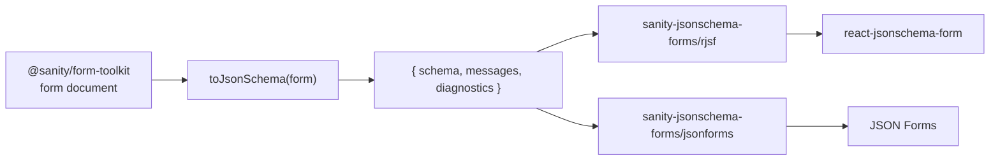

# sanity-jsonschema-forms

Compile forms authored with [`@sanity/form-toolkit`](https://www.npmjs.com/package/@sanity/form-toolkit)
into JSON Schema Draft 7. Render them with RJSF or JSON Forms, and validate
submissions against the same schema on the server.

Use this when editors manage forms in Sanity and your application already
uses a schema-driven renderer or needs a portable validation contract.
For a simple React form, form-toolkit's own renderer may be enough. This
package does not provide submission storage, uploads, or a Studio builder.



## Install

```bash
pnpm add sanity-jsonschema-forms
```

Then the form library of your choice. The compiler and adapters have no runtime renderer
dependencies; adapter peers supply types. See [docs/adapters](docs/adapters).

## Use

```ts
import {createClient} from '@sanity/client'
import {toJsonSchema} from 'sanity-jsonschema-forms'

const client = createClient({projectId: '<project-id>', dataset: 'production', apiVersion: '2026-09-04', useCdn: true})
const form = await client.fetch(
  `*[_type == "form" && id.current == $id][0]{
    title, id, submitButton,
    fields[]{_key, type, label, name, required, validation, options, choices}
  }`,
  {id: 'contact'},
)

if (!form) throw new Error('Form not found')
const compiled = toJsonSchema(form)
const {schema, messages, diagnostics} = compiled
```

The input is structurally typed, so frontends do not need form-toolkit
installed. Inspect `diagnostics` before using the schema: malformed fields
are dropped, `file` is unsupported, and date bounds or some range steps
cannot be represented. Reject error diagnostics and explicitly handle lossy
rules before accepting submissions. See [compatibility](docs/compatibility.md).

Then one of:

```tsx
import {Form} from '@rjsf/shadcn' // or any RJSF theme
import validator from '@rjsf/validator-ajv8'
import {toRjsfProps} from 'sanity-jsonschema-forms/rjsf'

const {schema, uiSchema, formProps, transformErrors} = toRjsfProps(form, compiled)
<Form {...formProps} schema={schema} uiSchema={uiSchema} validator={validator} transformErrors={transformErrors} />
```

```tsx
import {JsonForms} from '@jsonforms/react'
import {vanillaCells, vanillaRenderers} from '@jsonforms/vanilla-renderers'
import {toJsonFormsProps} from 'sanity-jsonschema-forms/jsonforms'

const {schema, uischema, translate, initialData} = toJsonFormsProps(form, compiled)
<JsonForms schema={schema} uischema={uischema} data={initialData} i18n={{translate}} renderers={vanillaRenderers} cells={vanillaCells} />
```

And on the server:

```ts
import Ajv from 'ajv'
import addFormats from 'ajv-formats'

const ajv = new Ajv({allErrors: true})
addFormats(ajv)
const isValidSubmission = ajv.compile(schema)
// Reuse isValidSubmission(submission) for this form revision.
```

## Documentation

- [Architecture](docs/architecture.md): code boundaries and scope.
- [Contract](docs/json-schema-contract.md): values, defaults, rules and messages.
- [Compatibility](docs/compatibility.md): supported types, losses and diagnostics.
- [Adapters](docs/adapters): renderer setup and limitations.

## Repository

```
packages/sanity-jsonschema-forms/  the package
packages/fixtures/                 private: form documents and submissions used by tests
examples/compare/                  one compiled form rendered by both adapters
docs/
```

```bash
pnpm install
pnpm verify:quick # lint, types, tests without jsdom
pnpm verify       # full CI gate, including renders and packed-package imports
pnpm dev       # examples/compare on http://localhost:5174
```

See [CONTRIBUTING.md](CONTRIBUTING.md). Status: `0.x`, experimental; the
public API may change between minor versions until `1.0`. Not affiliated
with Sanity.io. MIT.
