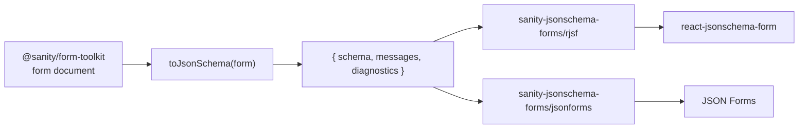

# sanity-jsonschema-forms

Standards-based form authoring for Sanity. Editors build a form in Sanity
Studio with [`@sanity/form-toolkit`](https://www.npmjs.com/package/@sanity/form-toolkit);
`sanity-jsonschema-forms` compiles that document into JSON Schema and ships thin
adapters for schema-driven form libraries.



The JSON Schema is the contract. It is [JSON Schema Draft 7](https://json-schema.org/draft-07)
and says so in its `$schema`, so it validates on its own with any validator
that supports that draft, every adapter consumes it unchanged, and the server
validates submissions against it whatever rendered the form.

## Install

```bash
pnpm add sanity-jsonschema-forms
```

Then the form library of your choice. Using the root entry needs no renderer
dependencies; each adapter's peer is optional and listed in [docs/adapters](docs/adapters).

## Use

```ts
import {createClient} from '@sanity/client'
import {toJsonSchema} from 'sanity-jsonschema-forms'

const client = createClient({projectId: '<project-id>', dataset: 'production', apiVersion: '2026-09-04', useCdn: true})
const form = await client.fetch(
  `*[_type == "form" && id.current == $id][0]{
    title, id, submitButton,
    fields[]{_key, type, label, name, required, validation, options, choices}
  }`,
  {id: 'contact'},
)

const compiled = toJsonSchema(form)
const {schema, messages, diagnostics} = compiled
```

`form` is the document as `@sanity/form-toolkit` stores it. The package
types it structurally, so the frontend does not need `@sanity/form-toolkit`
installed. `diagnostics` lists every field, rule or value the compiler could
not carry, with its position in the source document; the compiler never
throws on content.

Fifteen of form-toolkit's sixteen built-in field types compile. Where the
Studio can author a rule that JSON Schema Draft 7 cannot carry without a
validator extension (a date bound, a range step that does not count from
zero), the field compiles and the rule is reported as lossy; `file` has no
portable JSON representation and is reported as unsupported.
[docs/compatibility.md](docs/compatibility.md) gives each type its status
and the reasoning.

Then one of:

```tsx
import Form from '@rjsf/shadcn' // or any RJSF theme
import validator from '@rjsf/validator-ajv8'
import {toRjsfProps} from 'sanity-jsonschema-forms/rjsf'

const {schema, uiSchema, formProps, transformErrors} = toRjsfProps(form, compiled)
<Form {...formProps} schema={schema} uiSchema={uiSchema} validator={validator} transformErrors={transformErrors} />
```

```tsx
import {JsonForms} from '@jsonforms/react'
import {vanillaCells, vanillaRenderers} from '@jsonforms/vanilla-renderers'
import {toJsonFormsProps} from 'sanity-jsonschema-forms/jsonforms'

const {schema, uischema, translate, initialData} = toJsonFormsProps(form, compiled)
<JsonForms schema={schema} uischema={uischema} data={initialData} i18n={{translate}} renderers={vanillaRenderers} cells={vanillaCells} />
```

And on the server:

```ts
import Ajv from 'ajv'
import addFormats from 'ajv-formats'

const ajv = new Ajv({allErrors: true})
addFormats(ajv)
const isValidSubmission = (submission: unknown) => ajv.validate(schema, submission)
```

## Documentation

- [docs/architecture.md](docs/architecture.md): the decisions. The contract,
  the compiler output, what adapters may do, server-side validation, and why
  there is no intermediate form model.
- [docs/json-schema-contract.md](docs/json-schema-contract.md): exactly what
  the schema and the message map contain, and why Draft 7.
- [docs/compatibility.md](docs/compatibility.md): versions tested, every
  field type's status and why, per-renderer control support, diagnostic
  codes.
- [docs/adapters/](docs/adapters): per-library usage and the quirks each
  adapter handles.
- [docs/decisions/](docs/decisions): decision records. The first says why
  SurveyJS, tried as a third adapter, is not one, and what a form library
  must do to get an adapter here.

## Repository

```
packages/sanity-jsonschema-forms/  the package
packages/fixtures/                 private: form documents and submissions used by tests
examples/compare/                  one compiled form rendered by both adapters
docs/
```

```bash
pnpm install
pnpm test      # compiler, plain AJV, RJSF and JSON Forms renders, validator parity
pnpm verify    # everything CI runs: lint, typecheck, test, build, example, publint
pnpm dev       # examples/compare on http://localhost:5174
```

See [CONTRIBUTING.md](CONTRIBUTING.md). Status: `0.x`, experimental; the
public API may change between minor versions until `1.0`. Not affiliated
with Sanity.io. MIT.
