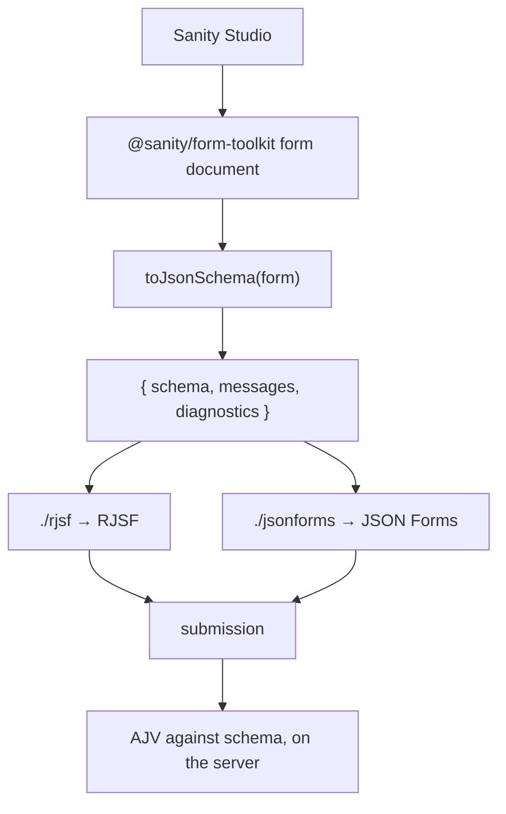

# Architecture

`sanity-jsonschema-forms` compiles a form authored in Sanity Studio with
[`@sanity/form-toolkit`](https://www.npmjs.com/package/@sanity/form-toolkit)
into JSON Schema, and ships thin adapters that let schema-driven form
libraries render and validate it.



## Decisions

| Decision | Choice | Why |
| --- | --- | --- |
| **Authoring** | `@sanity/form-toolkit`'s `form` document | This package adds no authoring model. Its input type is a structurally compatible subset of form-toolkit's `FormDataProps`, limited to the properties it reads and checked against it in the test suite, so a frontend can compile a fetched document without installing form-toolkit (whose peers include `sanity`). What the Studio can author is the ceiling; see [compatibility.md](compatibility.md). |
| **Canonical contract** | [JSON Schema Draft 7](https://json-schema.org/draft-07), declared by `$schema` | The dialect AJV, RJSF's validator and JSON Forms validate with by default, and the one every consumer tried reads natively. The schema uses no keyword that changed after Draft 7. Details and the case against 2020-12 in [json-schema-contract.md](json-schema-contract.md). |
| **Compiler output** | `schema`, `messages`, `diagnostics` | Editor-written error messages have no JSON Schema keyword, so they travel beside the schema keyed by field and AJV keyword. Everything that could not map one-to-one is a diagnostic; the compiler never throws on content. |
| **Renderer and runtime concerns** | subpath adapters (`./rjsf`, `./jsonforms`) | Each adds only what its library needs to present the schema: widget choice, placeholder, submit label, message delivery, and the library's own quirks. The schema passes through unchanged. Renderer dependencies are optional peers; the root entry has none. |
| **Adapter admission** | the library must consume JSON Schema as its native data and validation contract | `compiled.schema` reaches the library unchanged and the library's own validator checks against it; the adapter adds presentation only. SurveyJS failed the rule (it needs its own survey JSON rebuilt from the schema, and validates what its widgets produce) and was removed in `0.2.0`; TanStack Form would fail it today. [decisions/001](decisions/001-surveyjs-is-research-not-an-adapter.md). |
| **Submission validation** | AJV against `schema`, server-side, whatever rendered the form | Renderers validate what their widgets can produce, not arbitrary payloads. Spike 3 showed it with SurveyJS, which accepted duplicate checkbox values and off-list dropdown values the schema rejects. |
| **Intermediate `FormDefinition` model** | **deliberately rejected** | Three consumers of very different shape (RJSF, JSON Forms, and SurveyJS in spike 3) consumed the same schema and message map through adapters of 60 to 140 lines plus one 45-line internal helper carrying two presentation facts per field. No behaviour shared by two consumers exists outside JSON Schema. Widening to fifteen field types in 0.2 added source types to that helper and no new fact. |

## What an adapter is allowed to do

- Read `compiled.schema` and `compiled.messages`.
- Read the original form **only** for what JSON Schema cannot carry and is
  purely presentational: which input the editor chose where types share
  one schema (`textarea`/`text`, `radio`/`select`, the string types behind
  a pattern, `range`/`number`, `hidden`), the placeholder, the submit
  label. Both adapters get these through
  `src/internal/fields.ts`, which is not exported.
- Return its library's native structures and nothing invented: RJSF
  `uiSchema` and `<Form>` props, JSON Forms `uischema` and `i18n` hooks.

An adapter must not rewrite the schema, and must not derive anything from
another adapter's output.

## Adding a capability

New authoring capabilities enter through the compiler, as JSON Schema,
and each adapter derives its own mechanism from the schema the way choice
labels derive from `oneOf`. The first candidate is conditional visibility
(`if`/`then`/`else`), which both consumers can express and the Studio
cannot yet author. A capability that only one consumer can read does not
belong in the contract; it belongs in that adapter, behind an option.

## Layout

```
packages/sanity-jsonschema-forms/  the published package
  src/to-json-schema.ts            compiler
  src/rjsf.ts                      ./rjsf
  src/jsonforms.ts                 ./jsonforms
  src/internal/fields.ts           presentation facts shared by adapters (not exported)
  test/parity.test.ts              every fixture submission through AJV, RJSF's validator and JSON Forms' AJV
packages/fixtures/                 private: form documents and submissions used by tests
examples/compare/                  one compiled form rendered by both adapters
docs/                              this file, the contract, compatibility, per-adapter notes, decision records
```

## Design history

The architecture was settled in three tagged experiments before `0.1.0`.
`rjsf-spike-v1` compiled form-toolkit documents straight to RJSF and showed
the mapping was direct but carried RJSF-specific choices. `json-schema-spike-v2`
extracted a renderer-independent schema and moved those choices into a
thin adapter, with JSON Forms as a second consumer. `surveyjs-spike-v3` used
SurveyJS, the richest consumer available, to look for behaviour that would
justify a shared model beyond JSON Schema, and found none. Each tag holds
the code and the write-up of its experiment.

The SurveyJS adapter shipped in `0.1.0` and `0.1.1`. Widening it to
fifteen field types for `0.2` showed it reconstructing the contract rather
than consuming it, and SurveyJS validating its own translation rather than
the schema. [decisions/001](decisions/001-surveyjs-is-research-not-an-adapter.md)
records why it was removed in `0.2.0`, the admission rule that follows,
and the shape a SurveyJS integration with Sanity should take instead.
