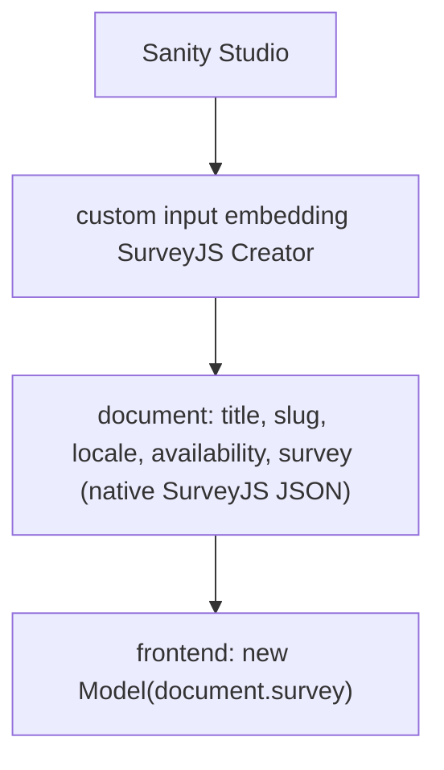

# 1. SurveyJS is research, not an adapter

Status: accepted, 2026-09-04. Applies from `0.2.0`.

## Summary

`sanity-jsonschema-forms/surveyjs` is removed in `0.2.0`. SurveyJS
validated the renderer-independent architecture but is not retained as a
supported adapter, because SurveyJS owns a richer native survey model and
does not consume JSON Schema as its primary contract. The package keeps
the two adapters whose libraries do: `./rjsf` and `./jsonforms`. The spike
that used SurveyJS stays tagged as `surveyjs-spike-v3`, and this record
carries what the adapter had learned, so nothing needs the history.

This also sets the admission rule for any future adapter (see
"Admission rule" below).

## Context

### What SurveyJS was for

Spike 3 (tag `surveyjs-spike-v3`, `docs/assessment-3.md` there) asked one
question: can the richest available consumer take the same JSON Schema
and message map as RJSF and JSON Forms, and does it expose any form
behaviour that two consumers share and JSON Schema cannot express? It
answered both. The adapter rebuilt every question from the schema, read
the form only for the same two presentation facts the other adapters
read (which input the editor chose, and its placeholder) plus the submit
label, and nothing SurveyJS offered (pages, `visibleIf`, calculated
values, dynamic panels, branching, scoring) was shared with another
consumer outside what JSON Schema already carries as nested objects,
arrays and `if`/`then`. That is the evidence behind the
"no intermediate form model" decision in [architecture.md](../architecture.md),
and it stands.

The same assessment recommended keeping the adapter as a subpath (its §7)
because it was small and had no runtime dependency. `0.1.0` and `0.1.1`
shipped it. This record reverses that one recommendation; the rest of
the assessment is unchanged.

### What 0.2 made visible

Widening to fifteen field types was the first sustained work on the
adapter after the spike, and it exposed a shape the spike's contact form
had hidden.

**The adapter does not consume the schema; it reconstructs from it.**
RJSF and JSON Forms take `compiled.schema` as an argument and validate
with it. The SurveyJS adapter walks the schema and emits a different
document, survey JSON, in which every keyword becomes a SurveyJS
validator, a question type or an input type, one by one. It grew to 267
lines against 83 and 93 for the two adapters that pass the schema
through, and each new field type added a mapping (an `inputType`, an
expression validator for `multipleOf`, `clearInvisibleValues: 'none'` to
keep a hidden field's default through completion). Those are SurveyJS
quirks, and the contract was carrying them.

**Parity divergences are the rule for SurveyJS, not the exception.**
`test/parity.test.ts` ran every fixture submission through plain AJV,
RJSF's validator, JSON Forms' AJV and SurveyJS. The three AJV consumers
never disagreed. SurveyJS accepted, where the schema rejects: a
duplicate value in a checkbox answer (`uniqueItems`); an off-list
dropdown value (`oneOf`); a numeric string in a number question (`type`);
`2026-02-30` and a five-digit year behind `inputType: date`
(`format: date`); an internationalized host, a non-ASCII path or a space
behind `inputType: url` (`format: uri`); and a required hidden field with no
default, because an invisible question is not validated. The cause is
one property of SurveyJS: it validates what its own widgets can produce,
not an arbitrary payload. That is correct behaviour for a survey runtime
and the reason submissions are validated with AJV on the server whatever
rendered the form, but it means SurveyJS never validated against the
contract at all. It validated against the adapter's translation of it.

### The product question

Even a technically clean SurveyJS integration has to answer who would
choose it. The user would want Sanity as the authoring system and
SurveyJS as the runtime while deliberately not using SurveyJS's own
authoring model, SurveyJS Creator. Such a user wants SurveyJS for pages,
branching, expressions, conditional visibility, calculated values,
dynamic panels, scoring or navigation, and `@sanity/form-toolkit` can
author none of them (see "What no adapter can add" in
[compatibility.md](../compatibility.md)). What the adapter offers is
therefore SurveyJS restricted to the subset form-toolkit can express:

| the forms a team needs | what the combination gives them |
| --- | --- |
| flat forms with per-field rules (form-toolkit's ceiling) | SurveyJS with none of the features that justify choosing it; RJSF or JSON Forms render the same schema with less |
| pages, logic, expressions, scoring | nothing; form-toolkit cannot author them, and the schema cannot carry them |

Neither row is a reason to install this package with SurveyJS.

### A direct form-toolkit → SurveyJS adapter, considered

Compiling the form document straight to survey JSON, without the JSON
Schema step, would be the better implementation of the same idea. It
would keep what JSON Schema deliberately discards (textarea versus text,
radio versus select, placeholders, submit labels, validation messages,
any future form-toolkit metadata) with no reconstruction, and it would
keep SurveyJS quirks local to one module instead of in the contract. It
is rejected all the same: it would be a second compiler beside
`toJsonSchema` with no shared contract, which is exactly what this
package is not, and it inherits the product question above unchanged.

## Decision

1. Remove `sanity-jsonschema-forms/surveyjs` (`toSurveyJsProps` and the
   `Survey*Json` types), its tests, its adapter document and its pane in
   `examples/compare`. `survey-core` and `survey-react-ui` leave the
   workspace. This is a breaking change, made in `0.2.0` before that
   version is tagged; `0.1.x` keeps the adapter.
2. Keep the internal helper (`src/internal/fields.ts`) as it is. It
   still carries exactly two presentation facts per field, now for two
   consumers.
3. Keep the evidence. The spike is tag `surveyjs-spike-v3` with its
   assessment and the headless capability probes; `v0.1.1` holds the
   adapter as released with its document; the summary above records what
   the widened adapter found.
4. Adopt the admission rule below for adapters.

### Admission rule

An adapter belongs in this package when its library **consumes JSON
Schema as its native data and validation contract**: `compiled.schema`
is passed to the library unchanged, and the library's own validator
validates against it. The adapter then adds only presentation
(widget choice, placeholder, submit label, message delivery) and
works around the library's quirks.

| library | consumes JSON Schema natively | place |
| --- | --- | --- |
| react-jsonschema-form | yes: `schema` prop, AJV validator | `./rjsf` |
| JSON Forms | yes: `schema` prop, AJV validator | `./jsonforms` |
| SurveyJS | no: its own survey JSON and expression language | separate project, different shape (below) |
| TanStack Form, or a shadcn form built on it | no: field configuration in code; validation by a schema library of the host's choice | not here until a JSON Schema → generated configuration path is proven; a higher bar than "popular library without a Sanity adapter" |

A library that fails the rule is not a worse library. It is a different
kind of integration, and forcing it through this contract weakens both
the library and the contract. The name `sanity-jsonschema-forms` should
mean what it says.

## Consequences

- The package proposition is one sentence: `@sanity/form-toolkit` →
  portable JSON Schema → schema-driven renderers.
- `pnpm test` runs three validators in parity, not four, and they agree
  on every fixture; there is no per-renderer divergence list to
  maintain. Each remaining divergence between a renderer and the schema
  is a library quirk documented in that adapter's page.
- `examples/compare` renders two panes.
- The "Submission validation" decision in
  [architecture.md](../architecture.md) keeps its rule (validate with AJV
  on the server, whatever rendered the form). Its strongest illustration
  was SurveyJS; the rule does not depend on it.
- The "no intermediate form model" decision keeps its evidence. SurveyJS
  remains the strongest counter-candidate tried, and it is on record.
- Anyone on `0.1.x` who uses `./surveyjs` stays on `0.1.x`, or vendors
  `src/surveyjs.ts` from `v0.1.1` together with the internal helper it
  reads; the adapter has no runtime dependency and is MIT.

## If SurveyJS comes back

It should be a separate project with a different proposition, and it
should not start from `@sanity/form-toolkit`. The division that makes
sense lets SurveyJS own the survey (semantics, pages, logic,
presentation model, its Creator as the designer) and Sanity own the
content lifecycle:

No JSON Schema step, no parity tests, no reconstruction of SurveyJS
concepts, no ceiling set by form-toolkit. Sanity would add what SurveyJS
lacks: publishing and versions, localization, references (a Sanity
dataset feeding dynamic choices), permissions, preview, and placement
within a page builder. That is a credible `sanity-surveyjs`; the adapter
this record removes was not.
